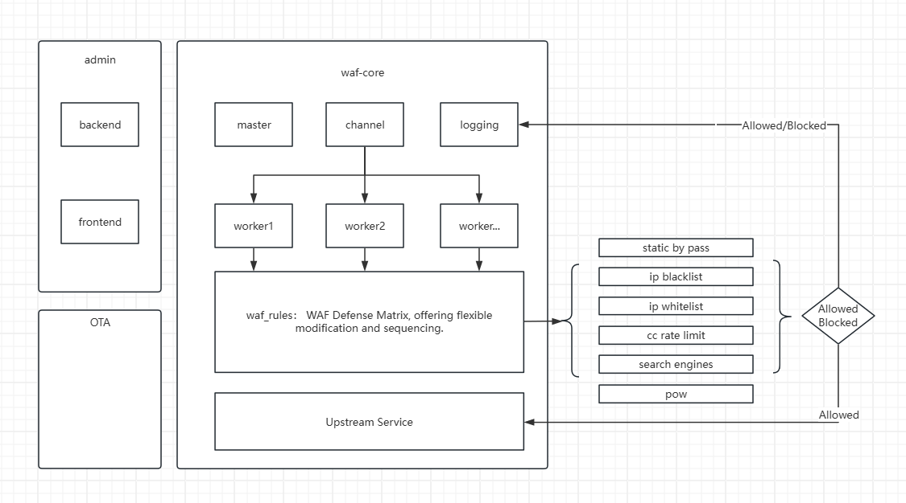

# vigie-waf — vigie Web Firewall

## What is this project
This is a cross-platform, all-in-one web defense solution written in Rust.
It aims to be extremely fast and rock-solid.

## Concurrency tests (version 1.2.3)

The following are local static resource access tests.
The defense architecture used for testing:

`vigie-waf` ===> `nginx` ===> `index.html`

### 200 concurrent connections


### 500 concurrent connections


## Project Architecture


## Project Progress
- [x] Core functionality implemented
- [x] Multi-process architecture
- [ ] Improve documentation
- [ ] Migrate to full in-memory shared architecture
- [ ] Other feature iterations
- [ ] Open-source the code


## How to run
### Direct download

#### Windows

1. Download the latest release from the releases page: https://github.com/pcloth/vigie-waf-rust-publish/releases

2. Run the executable from the project root:

```
./bin/vigie-waf-rust.exe
```

#### Linux

1. Download the latest release from the releases page: https://github.com/pcloth/vigie-waf-rust-publish/releases

2. Run the binary from the project root:

```
./bin/vigie-waf-rust
```

### Running with Docker

Because vigie-waf supports OTA upgrades, if you want to use OTA updates do not run the project directly from inside the container.
It is recommended to mount the host code directory into the container instead.

```sh
docker run -it -p 80:80 -p 443:443 \
  -v your_path:/app \
  pcloth/vigie-waf-rust:latest \
  -e ADMIN_USERNAME=admin \
  -e ADMIN_PASSWORD=admin123 \
  -e JWT_SECRET=298347sjfi#2212 \
  bash -c "export RUST_LOG=debug && /app/bin/vigie-waf-rust & while true; do echo hello world; sleep 60; done"
```

> Note: the `& while true; do echo hello world; sleep 60; done` part is added so the container does not stop while performing OTA upgrades. If you plan to perform manual upgrades, you can omit this.

Be sure to change the `ADMIN_USERNAME`, `ADMIN_PASSWORD`, and `JWT_SECRET` environment variables from their defaults.


## How to configure

### Step 1

After the application is running, open your browser and visit http://localhost to see the welcome page:


### Step 2

Click through to the admin login page:


Log in using the credentials you configured via environment variables.

> Default username: `admin`, default password: `admin123`

### Step 3

Change your language. Currently Chinese and English are supported.


### Step 4

Configure your site(s):


### Done

Thank you for trying vigie-waf.

